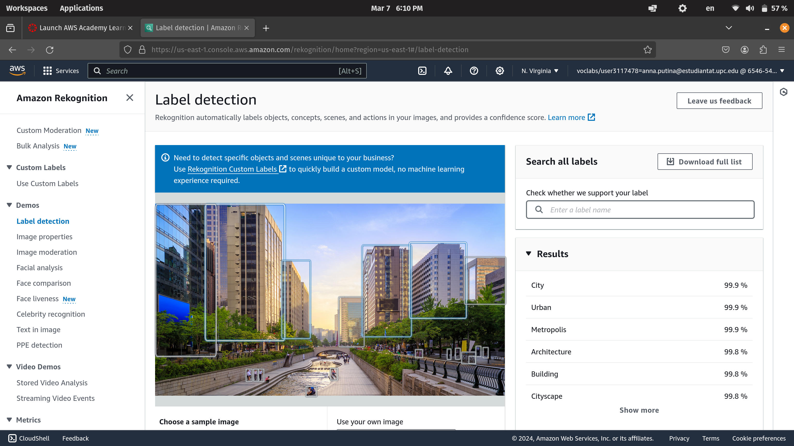
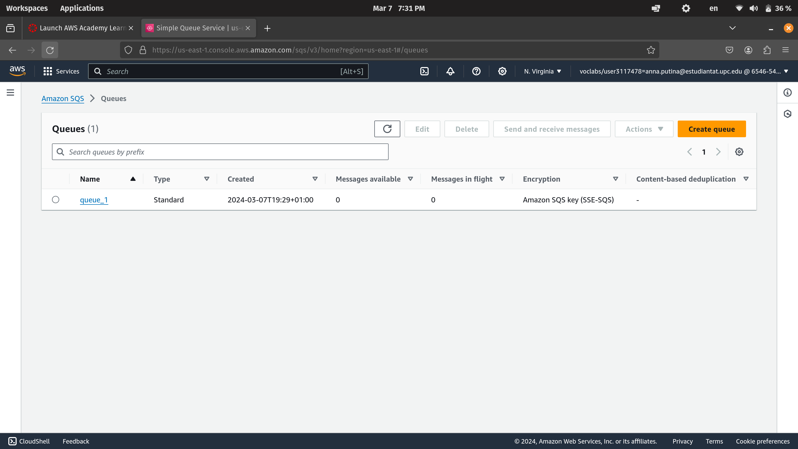
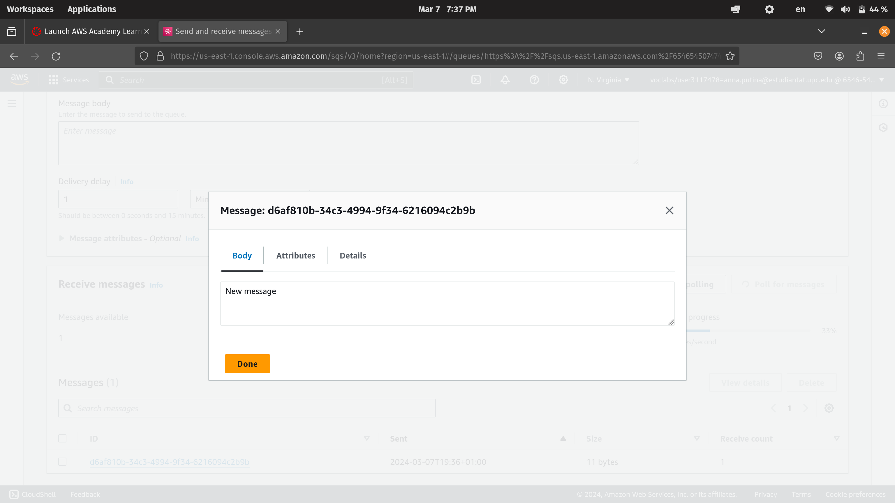
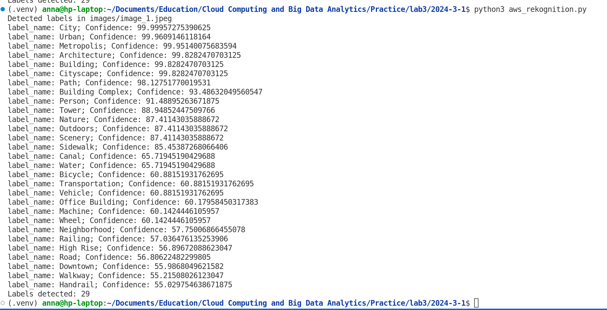

# Lab 3

## Task 3.4: use AWS Rekognition
We went to "Learner Lab" from the course "AWS Academy Learner Lab", and then accessed the AWS Console. We proceeded to the service "Amazon Rekognition", and launched the demo to explore the service. The functionality of the demo consists of uploading an image and receiving the labels for the recognized objects. Here is the example:

1. Choosing an image


2. Uploding the image:



We can see the results on the right bottom of the screen that contain the labels and the confidence. 

## Task 3.5: Create a python script that communicates with AWS services

### Case 3.5.1: AWS SQS

Amazon SQS provides queues for high-throughput, system-to-system messaging. You can use queues to decouple heavyweight processes and to buffer and batch work. Amazon SQS stores messages until microservices and serverless applications process them.

You could find the code for this section in the file [aws_sqs.py](aws_sqs.py).

We connected to the AWS server trough client provided by the `boto3` library.

The available functionalities are:

1. **create**: Create a new empty queue


```bash
python aws_sqs.py create queue_1
``` 
The response is: 

```
Queue 'queue_1' created. URL: https://sqs.us-east-1.amazonaws.com/654654507474/queue_1
```

We cpold see the queue also from the AWS Console:




2. **list**: List all existing queues

```bash
python aws_sqs.py list
```

The result is:

```
SQS Queues:
https://sqs.us-east-1.amazonaws.com/654654507474/queue_1
```

3. **send**: Send a message to a specific queue

```bash
python aws_sqs.py send 'https://sqs.us-east-1.amazonaws.com/654654507474/queue_1' "New message"
```

The result is:

```
Message sent. Message ID: d6af810b-34c3-4994-9f34-6216094c2b9b
```

The new message is accessable from the AWS Console:




1. **receive**: Receive the oldest message from a specific queue and delete it

```bash
python aws_sqs.py receive 'https://sqs.us-east-1.am
azonaws.com/654654507474/queue_1' 
```

The result is:

```
Received message: New message
Message deleted from the queue.
```
5. **delete**: Delete the queue

```bash
python aws_sqs.py delete queue_1
```

The result is:

```
Queue deleted: https://sqs.us-east-1.amazonaws.com/654654507474/queue_1
```


### Case 3.5.1: AWS Rekognition


Here we present the code from the file `aws_rekognotion.py`: 

```python
import boto3

def detect_labels_local_file(photo):
    client=boto3.client('rekognition')
   
    with open(photo, 'rb') as image:
        response = client.detect_labels(Image={'Bytes': image.read()})
    
    print(response)
    print('Detected labels in ' + photo)    
    for label in response['Labels']:
        print (f"label_name: {label['Name']}; Confidence: {label['Confidence']}")

    return len(response['Labels'])

def main():
    photo='images/image_1.jpeg'

    label_count=detect_labels_local_file(photo)
    print("Labels detected: " + str(label_count))

if __name__ == "__main__":
    main()
```

We connected to the AWS server trough client provided by the `boto3` library.

We used the detecting labels functionality provided by the Rekognition Service to label the image. To run the code use the command:

```bash
python aws_rekognition.py 
```

The result is  a list of lable and the corresponding confidence:



When we explored the servive from the AWS Console, the result was the same, which was presented in the Section 3.4.


